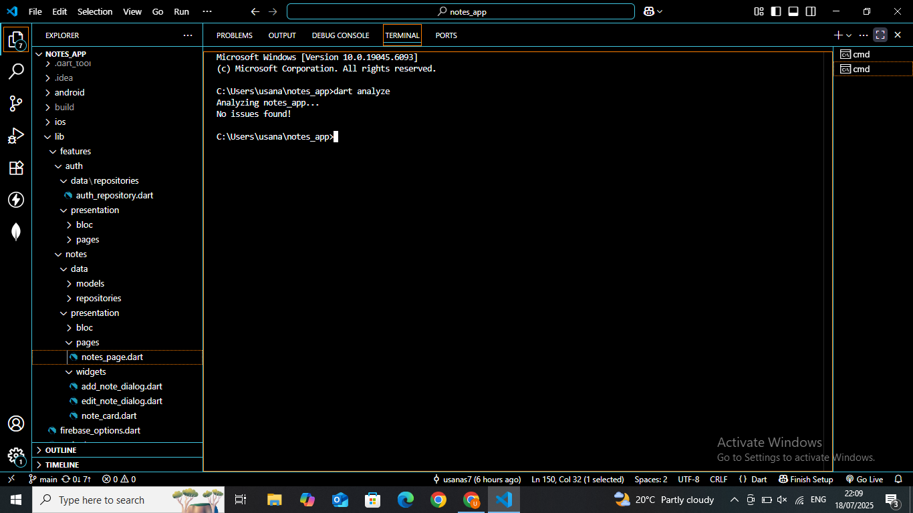

# Notes App - Flutter Firebase Integration

## Overview
A Flutter notes application with Firebase authentication and Firestore database integration, implementing clean architecture with proper state management.

## 🏗️ Architecture Diagram

```
┌─────────────────────────────────────────────────────────────┐
│                     PRESENTATION LAYER                      │
├─────────────────────────────────────────────────────────────┤
│  📱 UI Screens          │  🎯 State Management              │
│  • LoginScreen          │  • AuthCubit/Provider             │
│  • NotesListScreen      │  • NotesCubit/Provider            │
│  • AddNoteDialog        │  • UI State Updates               │
│  • EditNoteDialog       │                                   │
└─────────────────────────────────────────────────────────────┘
                                   │
                                   ▼
┌─────────────────────────────────────────────────────────────┐
│                     BUSINESS LOGIC LAYER                    │
├─────────────────────────────────────────────────────────────┤
│  🔧 Services            │  📋 Models                        │
│  • AuthService          │  • User Model                     │
│  • NotesService         │  • Note Model                     │
│  • ValidationService   │  • AppState Models                │
└─────────────────────────────────────────────────────────────┘
                                   │
                                   ▼
┌─────────────────────────────────────────────────────────────┐
│                        DATA LAYER                           │
├─────────────────────────────────────────────────────────────┤
│  🔥 Firebase Services   │  📊 Repositories                  │
│  • Firebase Auth        │  • AuthRepository                 │
│  • Cloud Firestore     │  • NotesRepository                │
│  • Error Handling      │  • Data Transformation            │
└─────────────────────────────────────────────────────────────┘
```

## 📁 Project Structure

```
lib/
├── main.dart
├── firebase_options.dart
├──features/
├── models/
│   ├── note.dart
│   └── user.dart
├── services/
│   ├── auth_service.dart
│   ├── notes_service.dart
│   └── validation_service.dart
├── repositories/
│   ├── auth_repository.dart
│   └── notes_repository.dart
├── screens/
│   ├── login_screen.dart
│   ├── notes_list_screen.dart
│   └── dialogs/
│       ├── add_note_dialog.dart
│       └── edit_note_dialog.dart
├── widgets/
   ├── note_item.dart
   ├── custom_button.dart
   └── loading_indicator.dart


## 🚀 Build Steps

- Flutter SDK (3.0.0 or higher)
- Dart SDK (2.18.0 or higher)
- Android Studio / VS Code
- Firebase CLI
- Git

### Setup Instructions

1. **Clone the Repository**
   
   git clone https://github.com/Usanas7/notes_app.git
   cd notes_app
   ```

2. **Install Dependencies**
   ```bash
   flutter pub get
   ```

3. **Firebase Configuration**
   ```bash
   # Install Firebase CLI (if not already installed)
   npm install -g firebase-tools
   
   # Login to Firebase
   firebase login
   
   # Install FlutterFire CLI
   dart pub global activate flutterfire_cli
   
   # Configure Firebase for your project
   flutterfire configure
   ```

4. **Environment Setup**
   - Ensure `firebase_options.dart` is generated in your `lib/` folder
   - Verify your Firebase project settings in the Firebase Console
   - Check that Authentication and Firestore are enabled

5. **Run the Application**
   ```bash
   # For Android
   flutter run
   
   # For specific device
   flutter run -d <device_id>
   
   # To see available devices
   flutter devices
   ```

6. **Build for Release**
   ```bash
   # Android APK
   flutter build apk --release
   
   # Android App Bundle
   flutter build appbundle --release
   ```

## 🔍 Dart Analyzer Report



**Status: ✅ Zero Warnings**

To run the analyzer yourself:
```bash
dart analyze
```

## 📱 Features Implemented

### ✅ CRUD Operations
- **Create**: Add new notes with validation
- **Read**: Fetch and display notes from Firestore
- **Update**: Edit existing notes in real-time
- **Delete**: Remove notes with confirmation

### ✅ Authentication
- User registration with email/password
- User login with Firebase Auth
- Session management
- Secure logout functionality

### ✅ UI/UX Features
- Empty state with helpful message
- Loading indicators during operations
- Success/error snackbar notifications
- Responsive design for different screen sizes

## 🔥 Firebase Integration

### Services Used:
- **Firebase Authentication**: Email/password authentication
- **Cloud Firestore**: NoSQL database for notes storage
- **Firebase Security Rules**: Proper data access control


## 🎥 Demo Video

[ Watch Full Demo Video](https://youtu.be/-8P1tGwSrZM)

**Demo includes:**
- User registration and login
- Empty state display
- Adding notes (with Firestore sync)
- Reading and displaying notes
- Deleting notes (with confirmation)
- Firebase console verification

## 🧪 Testing

### Manual Testing Checklist:
- [ ] User can register with valid email/password
- [ ] User can login with existing credentials
- [ ] Empty state displays correctly for new users
- [ ] Notes can be added and appear in Firestore
- [ ] Notes list displays correctly
- [ ] Notes can be edited and changes persist
- [ ] Notes can be deleted and removed from Firestore
- [ ] Error handling works for network issues
- [ ] Loading states display appropriately

## 🐛 Known Issues & Solutions

### Issue 1: Authentication Timeout
**Problem**: FlutterFire CLI authentication timeout
**Solution**: Manual Firebase CLI login and VPN/proxy check

### Issue 2: Placeholder API Keys
**Problem**: Default firebase_options.dart with placeholder values
**Solution**: Regenerate configuration file with correct project settings


## 👨‍💻 Author

**Christelle USANASE**
- GitHub: [@Usanas7]
- Email: [usanasechristelle7@gmail.com]
